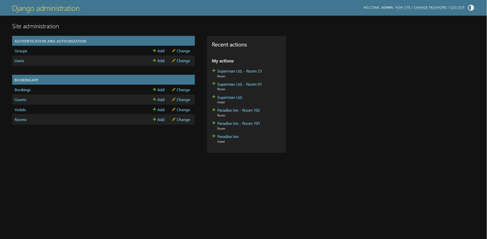
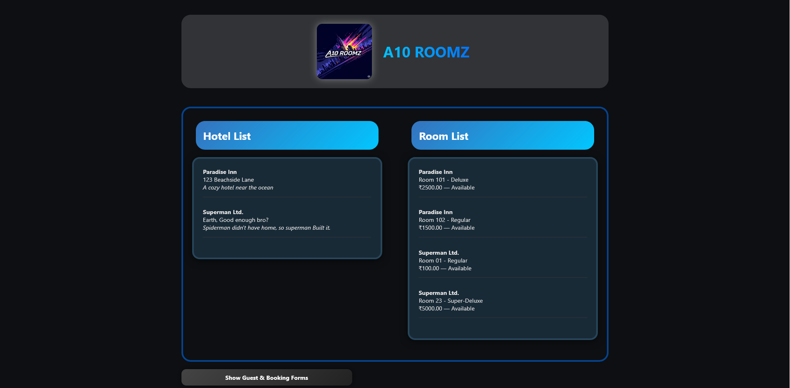
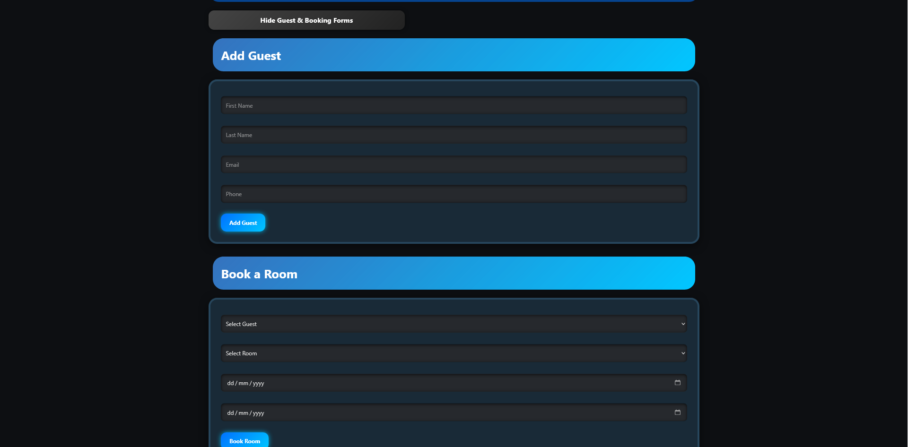
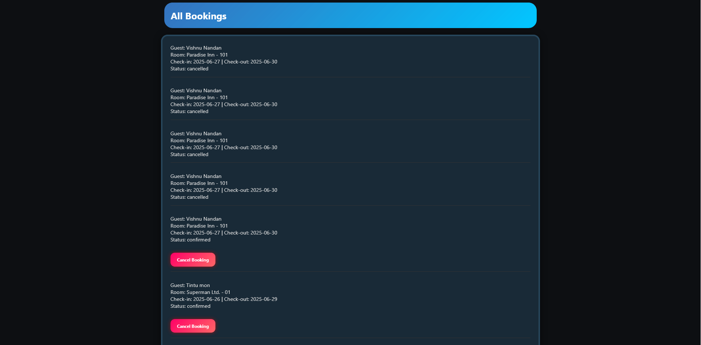

<p>
  
</p>


# Hotel Room Booking System

# A10 ROOMZ

A full-stack hotel booking application built with Django REST Framework (MySQL) and React.
Made with the help of ChatGPT.

---

## 🛠️ Tech Stack

- **Backend:** Django, Django REST Framework, MySQL
- **Frontend:** React (Create React App), Axios
- **Styling:** Custom CSS with dark-theme gradients and glows
- **Versioning:** Git & GitHub

---

## 🚀 Quick Start

1. **Clone the Repo**

   ```bash
   git clone https://github.com/YOUR_USERNAME/YOUR_REPO.git
   cd YOUR_REPO
   ```

2. **Backend Setup**

   ```bash
   cd backend
   python -m venv venv
   venv\Scripts\activate         # Windows
   # source venv/bin/activate    # macOS/Linux
   pip install -r requirements.txt
   ```

   **Configure MySQL**

   - Create database:
     ```sql
     CREATE DATABASE hotel_booking_db;
     ```
   - (Optional) Create dedicated user, or use `root` in `settings.py`.
   - In `hotelapi/settings.py`, set:
     ```py
     DATABASES = {
       'default': {
         'ENGINE': 'django.db.backends.mysql',
         'NAME': 'hotel_booking_db',
         'USER': 'root',
         'PASSWORD': 'root',
         'HOST': 'localhost',
         'PORT': '3306',
       }
     }
     ```

3. **Migrate & Create Superuser**

   ```bash
   python manage.py makemigrations
   python manage.py migrate
   python manage.py createsuperuser
   ```

   - **Username:** `admin`
   - **Email:** `admin@mail.com`
   - **Password:** `root@123`

4. **Run Backend**

   ```bash
   python manage.py runserver
   ```

   - API root: `http://127.0.0.1:8000/`
   - API endpoints under: `http://127.0.0.1:8000/api/`

5. **Frontend Setup** (new terminal)

   ```bash
   cd ../frontend
   npm install
   npm start
   ```

   - App: `http://localhost:3000`

---

## ⚙️ API Endpoints

| Method | Endpoint              | Description                                      |
| ------ | --------------------- | ------------------------------------------------ |
| GET    | `/api/hotels/`        | List/Create hotels                               |
| GET    | `/api/hotels/{id}/`   | Retrieve/Update/Delete a specific hotel          |
| GET    | `/api/rooms/`         | List/Create rooms                                |
| GET    | `/api/rooms/{id}/`    | Retrieve/Update/Delete a room                    |
| GET    | `/api/guests/`        | List/Create guests                               |
| GET    | `/api/guests/{id}/`   | Retrieve/Update/Delete a guest                   |
| GET    | `/api/bookings/`      | List/Create bookings (with date-conflict checks) |
| GET    | `/api/bookings/{id}/` | Retrieve/Update/Delete a booking                 |
| PATCH  | `/api/bookings/{id}/` | Partially update (e.g. cancel booking)           |

---

## 🎯 Features

- **Full CRUD** for hotels, rooms, guests, bookings
- **Date-overlap validation** prevents double-booking
- **Cancel booking** via status update
- **Dark theme** UI with gradients & glows
- **Axios** for clean API calls
- **Django Admin** for manual data management

---

## 🧪 Sample Workflow

1. **Add Hotel & Rooms**

   - Visit Django Admin: `http://127.0.0.1:8000/admin/`
   - Create Hotel and Rooms.

2. **Add Guest**

   - Frontend: fill “Add Guest” form → Success message.

3. **Book Room**

   - Frontend: fill “Book a Room” form → Success or “Room is already booked” error.

4. **View & Cancel**

   - Frontend: “All Bookings” list → click **Cancel Booking** to free up the room.

---

## 📂 Project Structure

```
Hotel Room Booking/
├── backend/
│   ├── hotelapi/            # Django project
│   ├── bookingapp/          # Models, APIs, serializers, views
│   ├── venv/                # Python virtualenv
│   ├── requirements.txt
│   └── manage.py
└── frontend/
    ├── public/
    ├── src/
    │   ├── components/      # React components
    │   ├── api.js           # Axios instance
    │   ├── HotelBooking.css # Dark-theme styling
    │   └── App.js
    └── package.json
```

---

## 🖼️ Demo Screenshots

Show off your app in action with the following images:

<p align="center">
  
  <br/>
  <em>Django Admin: Manage Hotels, Rooms, Guests, Bookings</em>
</p>

<p align="center">
  
  <br/>
  <em>Hotel List and Room List side-by-side</em>
</p>

<p align="center">
  
  <br/>
  <em>Collapsible Add Guest and Book Room forms</em>
</p>

<p align="center">
  
  <br/>
  <em>All Bookings list with cancel buttons</em>
</p>

---

## 🤝 Afterwords

This is me trying to learn full stack development, although I have used considerable amount of AI, I aim to decrease the dependance
of any usage of AI whatsoever.
## Special Thanks to my mentor, Ms. Anjusha V L for guiding me throughout.

---

## 📝 License

This Project is not licensed, you may use it for whatsoever. 

---

# Happy coding! 🚀

